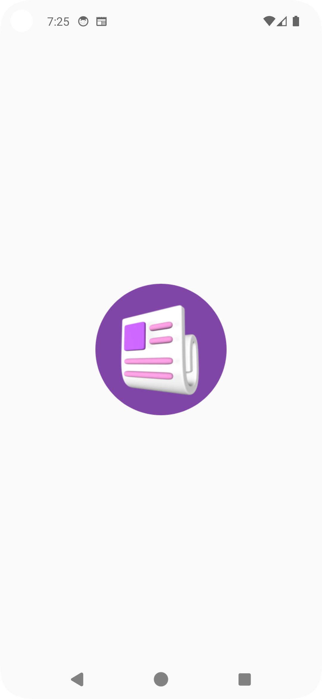

# Compose News App

## 📱 Features
- Latest news from API
- Clean UI with Jetpack Compose
- MVVM Architecture
- Error & Loading handling

## 🛠 Tech Stack
- Kotlin
- Jetpack Compose
- Retrofit
- StateFlow

## 📸 Screenshots
### 📰 News List Screen

### 📰 News List Screen

### 📄 Detail Screen

## 🧠 Architecture
MVVM with Repository pattern

## ✨ Features
- News API integration
- Jetpack Compose UI
- Navigation between screens
- Image loading using Coil
- MVVM Architecture

## ⚠️ Note
Add your NewsAPI key in MainActivity to run the project.

## 🚀 How to run
1. Clone repo
2. Add your API key
3. Run app